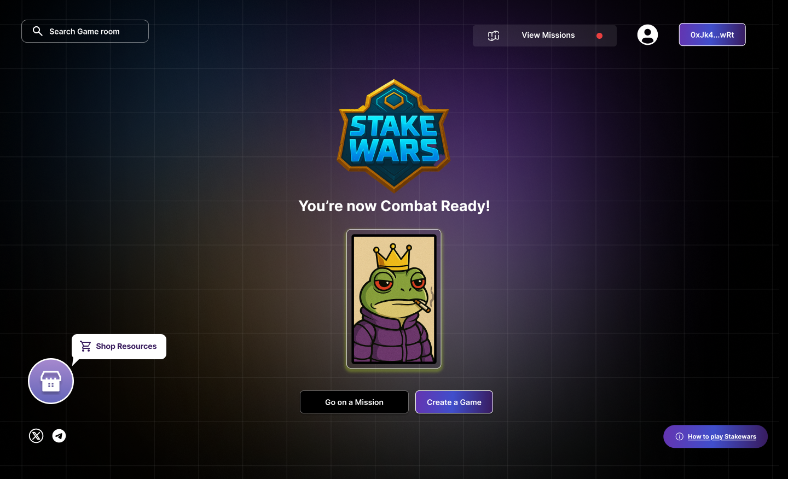
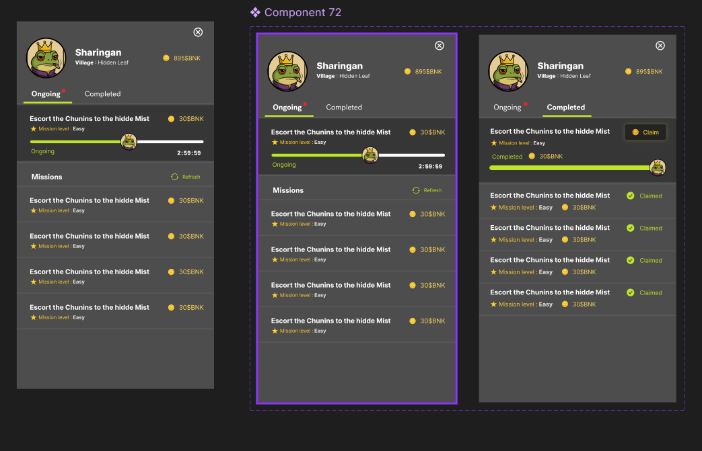
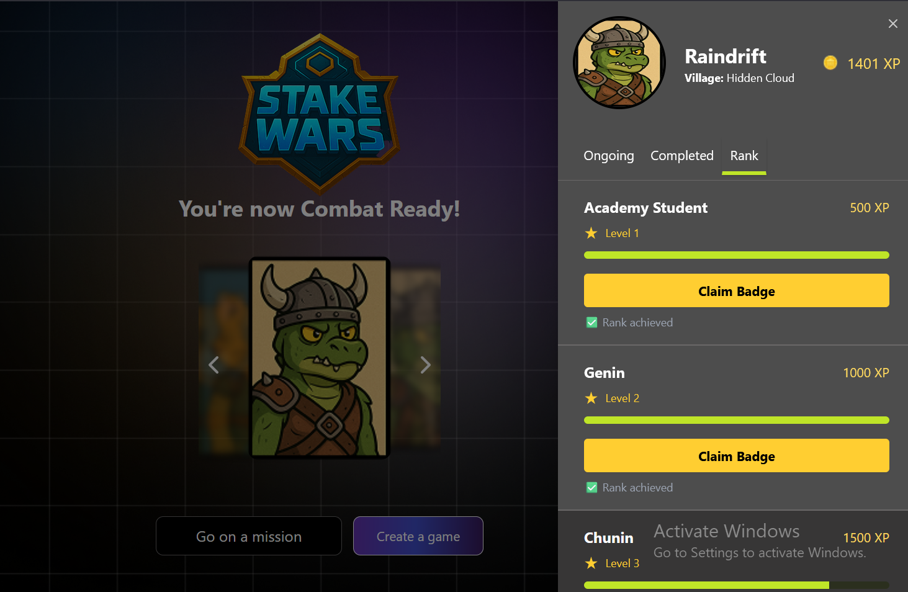

# StakeWars – On-Chain Ninja RPG Powered by Honeycomb Protocol  

  

**StakeWars** is a feudal ninja strategy game that redefines what progression means in gaming. Instead of temporary XP bars, off-chain achievements, or reset inventories, every action, contribution, and victory in StakeWars is **verifiably recorded on-chain** using Honeycomb Protocol. Players grow, evolve, and own their progress—permanently.  

---

## 📌 Table of Contents

- [Game Overview](#-game-overview)  
- [How Honeycomb Powers StakeWars](#-how-honeycomb-powers-stakewars)  
  - [Missions and Quests](#1-missions-and-quests--permanent-verifiable-rewards)  
  - [Trait Assignment and Evolution](#2-trait-assignment-and-evolution--ninja-identity-on-chain)  
  - [On-Chain Progression and Experience Systems](#3-on-chain-progression-and-experience-systems)  
- [Player Loop](#-player-loop--how-your-actions-matter)  
- [Marketplace & Resources](#-marketplace--resources)  
- [Visual Assets](#-visual-assets)  
- [Demo Video](#️-demo-video)  
- [Game Design Development](#-game-design-development)  
- [Tech Stack](#-tech-stack)  
- [Why StakeWars is Different](#-why-stakewars-is-different)  
- [Future Roadmap](#-future-roadmap)  
- [Getting Started](#getting-started)  

---

## 🎮 Game Overview  

StakeWars lets players mint, train, and command elemental ninja characters from four elite villages. Players can:  

- Engage in **fast-paced PvP duels** powered by dice rolls.  
- Send their ninja on **missions and staking quests** that earn XP and gold while idle.  
- **Level up**, unlock abilities, acquire village-specific tools, and climb competitive leaderboards.  

The core loop is simple but deep:  

1. Select or mint a ninja character (NFT).  
2. Choose a mode: PvP, PvE, or Missions/Staking.  
3. Roll dice to determine ability usage in combat.  
4. Win battles or complete missions → earn XP & gold.  
5. Level up, evolve traits, buy resources → repeat.  

**PvP and PvE matches last ~2–3 minutes.** Missions and staking are idle, lasting hours to a full day. Returning early forfeits rewards.  

---

## 🔹 How Honeycomb Powers StakeWars  

Honeycomb Protocol is the backbone of StakeWars’ on-chain progression, making every player action, contribution, and identity meaningful. Here’s how it fits:  

### 1. **Missions and Quests – Permanent, Verifiable Rewards**  

When a player sends a ninja on a mission or staking quest:  

- **Mission start and duration are recorded on-chain.** This ensures that rewards are earned honestly—no cheating or resets.  
- **XP and gold rewards are linked directly to the NFT.** The ninja literally “carries” its progress.  
- **Early recall is penalized** automatically by the protocol; unfinished missions yield no rewards.  

**Why it matters:**  
- Players’ contributions are permanent and verifiable.  
- Missions persist across devices and sessions.  
- Rewards are trustless: the blockchain is the source of truth.  

**  

---

### 2. **Trait Assignment and Evolution – Ninja Identity On-Chain**  

Every ninja NFT comes with **traits** assigned at minting:  

- Elemental type (Fire, Water, Wind, Earth, Lightning)  
- Attack abilities (4 per ninja)  
- Defense abilities (2 per ninja, e.g., dodge, block, reflect)  

As the player earns XP:  

- **Levels are recorded on-chain.** Each level increases attack power or unlocks new abilities.
- **Identity is portable:** if a ninja NFT is traded, the new owner inherits its full progression.  

**Why it matters:**  
- Players own their ninja identity and evolution.  
- Traits and stats are transparent and verifiable by anyone. 

---

### 3. **On-Chain Progression and Experience Systems**  

Every XP gain, level-up, and gold reward is **tracked on-chain**:  

- Leveling increases attack power: +5 per level for all attack abilities.  
- Gold purchases tools or resources in the village-specific marketplace.  
- Achievements, contributions, and battle outcomes are permanently tied to the NFT.  

**Why it matters:**  
- Progress cannot be erased or reset.  
- Players’ contributions are **trustless and verifiable**.  
- On-chain progression allows **reputation systems, skill trees, and loyalty mechanics** to be built directly into gameplay.  

**  

---

## 📈 Player Loop – How Your Actions Matter  

1. Mint or select your ninja NFT.  
2. Choose PvP, PvE, or idle missions.  
3. Roll dice to determine abilities in combat.  
4. Win or complete missions → **earn XP & gold on-chain**.  
5. Level up → evolve traits → acquire resources.  
6. Repeat: each action adds permanent value to your ninja NFT.  

**Every dice roll, mission, or level-up is meaningful.** Honeycomb tracks it all.  

---

## 🏪 Marketplace & Resources  

- Trade resources and tools on-chain using gold.  
- All ninja NFTs are **fully tradable**, with progression and traits intact.  
- Marketplace supports village-specific upgrades to reinforce identity and strategy.  

---

## ▶️ Demo Video  

**Watch the gameplay walkthrough here:**  
[video walkthrough](https://drive.google.com/file/d/1SWlJrvXecEwj1OHZZM7ueVoq7SFIiAPa/view?usp=sharing)  

---

## 🎮 Game Design Development  

**Go through the GDD here:**  
[Game design development](https://docs.google.com/document/d/1vs_uJkjgt7fe2yu2yWIYwhJbeCHyxg6EuATC_Os5GV0/edit?usp=sharing)  

---

## 🛠️ Tech Stack  

- **Solana Blockchain** – On-chain progression and verifiable state.  
- **Honeycomb Protocol** – NFT traits, mission tracking, and XP/gold recording.  
- **React + Next.js** – Frontend and interactive UI.  
- **Tailwind CSS** – Styling.  

---

## ✨ Why StakeWars is Different  

- **Player actions are permanent:** Every mission or battle outcome is tracked on-chain.  
- **Identity is meaningful:** Each ninja NFT evolves with the player, not just visually.  
- **Progression is portable:** NFTs can be traded or sold with all XP, traits, and resources intact.  
- **Honeycomb as a core mechanic:** The protocol isn’t just a backend—it **shapes gameplay**, rewards contribution, and powers strategic growth.  

StakeWars demonstrates a creative way to use Honeycomb Protocol: **player contribution and progression are part of the game’s DNA, not an afterthought.**  

---

## 📝 Future Roadmap  

- Expand ninja roster (4 villages × 5 chakra types)  
- Add additional abilities and rare traits  
- Introduce PvP leaderboards with on-chain scoring  
- Build seasonal events that reward on-chain contributions  
- Snakes and ladders-type maps for adventure
- Village vs Village tournaments/wars

---

## Getting Started

First, run the development server:

```bash
npm run dev
# or
yarn dev
# or
pnpm dev
# or
bun dev
```

Open [http://localhost:3000](http://localhost:3000) with your browser to see the result.

---

**StakeWars isn’t just a game—it’s a living, evolving ninja world where every action, every dice roll, and every mission counts on-chain.** 
